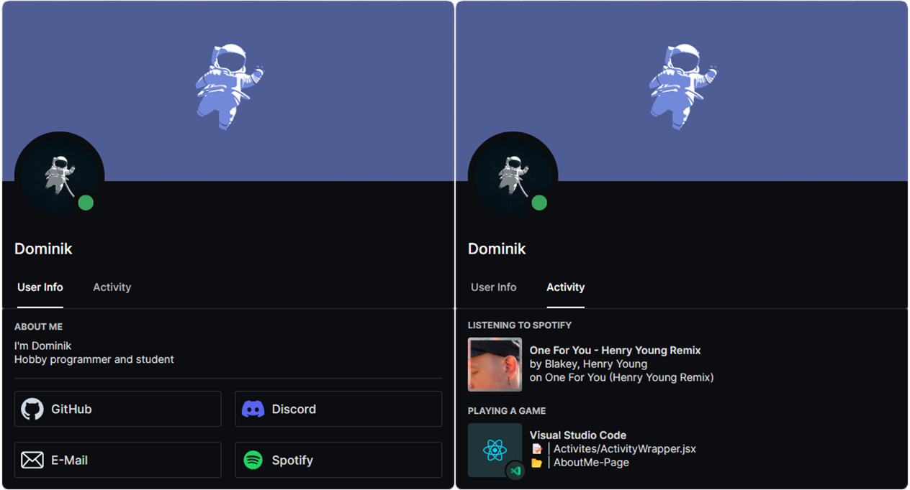

# About Me Page
Simple about me page build with React. Looks like the Discord User Modal



## Run Locally
Clone the project
```bash
git clone https://github.com/HypedDomi/AboutMe-Page
```

Go to the project directory
```bash
cd AboutMe-Page
```

Install dependencies
```bash
npm install
```

Start the server
```bash
npm run start
```

